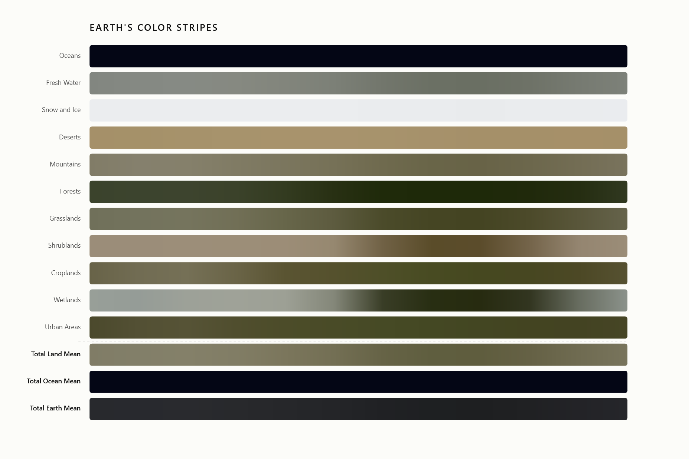

# Earth in Hues

> A geospatial project for computing area-weighted mean spectral signatures across land cover categories using satellite imagery, elevation data, and land classification rasters.

    

## Overview

The project processes multi-source satellite data to compute the true, physically-representative average RGB color of distinct surface categories: oceans, forests, deserts, ice sheets, urban areas, and more, for each calendar month. The result is a structured dataset (`earth_hues.json`) mapping every surface category to a hex color per month, corrected for the spatial distortion inherent in geographic coordinate grids. The output is then used in D3 for visualizations.

## Data Sources

| Dataset                             | Format                      | Description                                                            |
| ----------------------------------- | --------------------------- | ---------------------------------------------------------------------- |
| Monthly NASA Blue Marble (12 files) | GeoTIFF (`.TIFF`)           | True-color RGB satellite composites at ~10km resolution, one per month |
| GEBCO 2025 Bathymetry/Elevation     | Multi-tile GeoTIFF (`.tif`) | Global seabed and terrain elevation, stitched from tile mosaic         |
| MODIS MCD12C1 Land Cover            | HDF (`.hdf`)                | IGBP land cover classification at 0.05° resolution                     |

## Methodology

### 1. Reference Grid Establishment

All datasets are aligned to a common spatial reference frame derived from the January Blue Marble composite:

$$\text{Grid} \in \mathbb{R}^{1800 \times 3600}, \quad \Delta\lambda = \Delta\phi = 0.1°$$

This yields a global unprojected grid in **EPSG:4326** (WGS84), covering the full extent $[-90°, 90°] \times [-180°, 180°]$.

### 2. GEBCO Elevation Mosaic

The GEBCO dataset is distributed as a set of regional tiles. Each tile is spatially located within the reference grid using the rasterio window transform:

$$W = \mathrm{from\_bounds}(\mathrm{bounds}_{\mathrm{tile}},\ T_{\mathrm{ref}})$$

where $T_{\text{ref}}$ is the affine transform of the reference grid. Each tile is then downsampled via **average resampling** from its native resolution to the target grid dimensions:

$$\hat{e}_{i,j} = \frac{1}{|\mathcal{P}_{i,j}|} \sum_{p \in \mathcal{P}_{i,j}} e_p$$

where $\mathcal{P}_{i,j}$ is the set of native-resolution pixels that map onto target pixel $(i, j)$. The resulting array $\mathbf{E} \in \mathbb{R}^{1800 \times 3600}$ stores signed elevation in metres, with negative values indicating ocean depth.

### 3. Land Cover Reprojection

The MODIS MCD12C1 product provides the **IGBP land surface classification** (subdataset 0). Because this HDF dataset lacks an explicit geotransform, it is reprojected to the reference grid using **nearest-neighbour resampling** to preserve discrete class labels:

$$L_{i,j} = L_{\text{src}}\!\left(T_{\text{src}}^{-1}\!\left(T_{\text{ref}}(i, j)\right)\right)$$

The resulting integer array $\mathbf{L} \in \mathbb{Z}^{1800 \times 3600}$ assigns each pixel one of 17 IGBP classes (0–16).

### 4. Latitude-Cosine Area Weighting

#### Motivation

In an unprojected geographic coordinate system (equirectangular projection), every pixel subtends an equal angular area of $\Delta\phi \times \Delta\lambda$ degrees. However, the **physical area** represented by a pixel is not constant — longitude lines converge toward the poles.

#### Derivation

Modelling the Earth as a sphere of radius $R$, the circumference of a latitude circle at latitude $\phi$ is:

$$C(\phi) = 2\pi R \cos(\phi)$$

A longitude step of $\Delta\lambda$ radians therefore spans a physical arc length of:

$$\Delta x(\phi) = R \cos(\phi)\, \Delta\lambda$$

The physical area of a pixel at latitude $\phi$ is:

$$A(\phi) = R\,\Delta\phi \cdot R\cos(\phi)\,\Delta\lambda = R^2 \Delta\phi\,\Delta\lambda \cos(\phi)$$

Since $R^2 \Delta\phi\,\Delta\lambda$ is a constant for a uniform grid, the relative weight of any pixel row is simply:

$$\boxed{w(\phi) = \cos(\phi)}$$

#### Implementation

The weight for each pixel row $i$ is computed by mapping its row index to geographic latitude via the affine transform:

$$\phi_i = T_{\text{ref}}(i,\ 0)_y$$

$$w_i = \cos\!\left(\frac{\pi \phi_i}{180}\right)$$

The 1D weight vector $\mathbf{w} \in \mathbb{R}^{1800}$ is broadcast to a 2D array $\mathbf{W} \in \mathbb{R}^{1800 \times 3600}$ with uniform weight across all columns within a row.

**Representative values:**

| Location   | Latitude $\phi$ | Weight $w(\phi)$            |
| ---------- | --------------- | --------------------------- |
| Equator    | $0°$            | $\cos(0°) = 1.000$          |
| New York   | $40.7°$         | $\cos(40.7°) \approx 0.758$ |
| Oslo       | $59.9°$         | $\cos(59.9°) \approx 0.502$ |
| North Pole | $90°$           | $\cos(90°) = 0.000$         |

### 5. Surface Category Masking

Binary masks are constructed by combining elevation data $\mathbf{E}$, land cover labels $\mathbf{L}$, and a **topographic roughness index** derived from the gradient of the DEM:

$$\nabla E = \left(\frac{\partial E}{\partial x},\ \frac{\partial E}{\partial y}\right), \qquad \rho_{i,j} = \sqrt{\left(\frac{\partial E}{\partial x}\right)^2 + \left(\frac{\partial E}{\partial y}\right)^2}$$

| Category     | Mask Condition                            |
| ------------ | ----------------------------------------- |
| Oceans       | $L = 0 \;\wedge\; E < 0$                  |
| Fresh Water  | $L = 0 \;\wedge\; E \geq 0$               |
| Snow and Ice | $L = 15$                                  |
| Deserts      | $L = 16$                                  |
| Forests      | $L \in \{1, 2, 3, 4, 5\}$                 |
| Grasslands   | $L \in \{8, 9, 10, 14\}$                  |
| Shrublands   | $L \in \{6, 7\}$                          |
| Croplands    | $L = 12$                                  |
| Wetlands     | $L = 11$                                  |
| Urban Areas  | $L = 13$                                  |
| Mountains    | $E > 1000\,\text{m} \;\wedge\; \rho > 50$ |
| Total Land   | $E \geq 0 \;\wedge\; L \neq 0$            |
| Total Ocean  | $E < 0$                                   |
| Total Earth  | $\top$ (all pixels)                       |

### 6. Area-Weighted Mean Color Extraction

For each month $m$ and category $k$, the combined pixel mask is:

$$\mathcal{M}_{k}^{(m)} = \text{mask}_k \;\cap\; \text{valid}_m$$

where $\text{valid}_m$ is the set of pixels with non-nodata values in month $m$'s RGB composite (obtained from the rasterio dataset mask).

The weighted mean of each color channel $c \in \{R, G, B\}$ over the masked pixel set is:

$$\bar{c}_k^{(m)} = \frac{\displaystyle\sum_{(i,j) \in \mathcal{M}_{k}^{(m)}} w_{i}\; c_{i,j}}{\displaystyle\sum_{(i,j) \in \mathcal{M}_{k}^{(m)}} w_{i}}$$

This is a standard weighted arithmetic mean where each pixel's contribution is scaled by its physical area proxy $w_i = \cos(\phi_i)$.

The three channel means are then encoded to a hexadecimal string:

$$\mathrm{hex}_k^{(m)} = \#\,\lfloor \bar{R} \rceil_{255}\,\lfloor \bar{G} \rceil_{255}\,\lfloor \bar{B} \rceil_{255}$$

where $\lfloor \cdot \rceil_{255}$ denotes rounding and clamping to $[0, 255]$.

## Notes

- **Resampling strategy**: Average resampling is used for continuous elevation data (GEBCO) to preserve radiometric fidelity during downscaling. Nearest-neighbour is used for categorical land cover (MODIS) to prevent class interpolation artifacts.
- **Pole exclusion**: The cosine weighting naturally suppresses polar pixels toward zero, but does not hard-exclude them — their contribution diminishes smoothly as $\phi \to \pm 90°$.
- **Mountain definition**: The mountain mask uses a compound criterion — elevation above 1000 m _and_ roughness above 50 gradient units — to distinguish genuine orography from flat elevated plateaus.
- **Water disambiguation**: Inland water bodies (lakes, rivers) share IGBP class 0 with ocean but are distinguished by the sign of the DEM, since ocean pixels carry negative GEBCO elevation.
