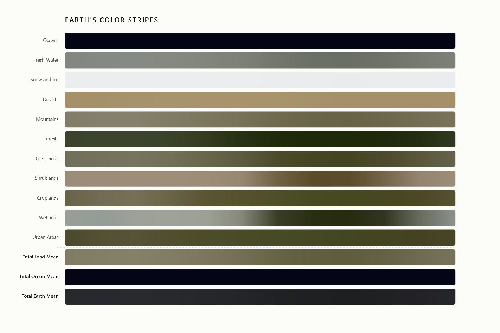

# Earth in Hues

The area-weighted mean colour of every surface on Earth, month by month, from satellite
imagery.

**[Read the write-up](https://snes19xx.github.io/earth-in-hues/)** ·
**[Methods notebook](notebooks/earth_in_hues.ipynb)**

<div align="center">
    
</div>

## Findings

**Earth's surface is a mid grey, `#565552`.** Earlier versions of this project said
`#28292d`, a near-black. The old number came from averaging gamma-encoded pixel values,
which is always too dark. Decoding to linear light first moves the answer by 15.2 ΔE₀₀.

**The size of that error tracks the spread inside each category**, at r = 0.940 across
168 category-months. Uniform categories like ocean and snow barely move. Mixed ones move
a lot.

**Earth is blue because of the air, not the water.** Ocean surface reflectance is under
half a percent. Add a Rayleigh layer and the ocean goes `#060a16` -> `#30415c` while the
Sahara barely shifts, because scattered blue only wins over a dark surface.

**One satellite would have produced a false result.** Over 2001 to 2024 Terra reports
the ocean brightening at +0.404 L\* per decade. Aqua reports −0.234 and no significance.
Over land the two differ by only 0.008. Forests darkened on both, by about 0.5 L\* per
decade.

## Running it

```bash
# My recommended way:
mamba env create -f environment.yml
mamba activate geo_env
pip install -e .
```

Inputs are about 8 GB and are not in this repository. See
[docs/DATA_SOURCES.md](docs/DATA_SOURCES.md) for where to get them and how to lay out
`DATA/`.

```bash
make colors      # monthly mean colour per category
make stats       # spread, percentiles, area share
make masks       # category raster for the map
make space       # surface, atmosphere and cloud views
make epic        # observed disk colour from DSCOVR
make fetch       # 276 MODIS composites, about 2.7 GB
make timeseries  # multi-year trends
make serve       # the page at localhost:8000
```

## Layout

```
index.html, style.css, js/    the write-up
src/earthhues/                the code behind every number
notebooks/                    methods, with output
data/                         generated colour and trend data
docs/DATA_SOURCES.md          where the inputs come from
```

## Sources

- NASA Blue Marble Next Generation
- GEBCO 2025
- MODIS MCD12C1
- MODIS surface reflectance via NASA GIBS
- DSCOVR EPIC
